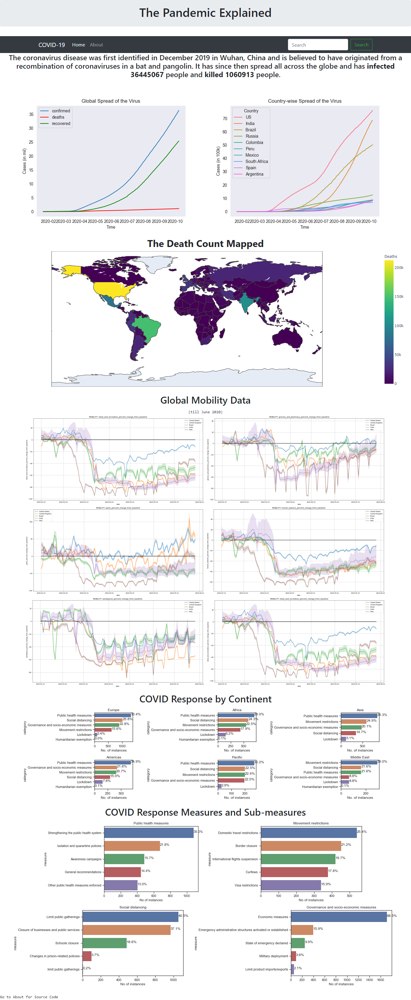

# the-pandemic-explained
 local flask web app
 
 The dashboard contains insights into the COVID-19 pandemic. The source and data analysis methods and visualisations is explained at [Global-Analysis-COVID-19.](https://github.com/tanyajainC137/COVID-19-Global-Analysis)
 
 > The dashboard contains three types of visuals: _static graphs_ , _dynamic graphs_ and _interactive graphs_.

## To access the dashboard
1. clone the repo
2. activate the virtual environment 'envr'
3. pip install the dependancies in requirements.txt
4. run app.py
5. go to (https://localhost:8000/home) in your browser

That's it! The dashboard will be running.

The making of the dashboard is documented as part of my 100-days-of-ML challenge [here](https://github.com/tanyajainC137/100-Days-of-ML/tree/master/Day_7)

### Screenshot of the Dashboard

_Last updated 9 Oct 2020_
